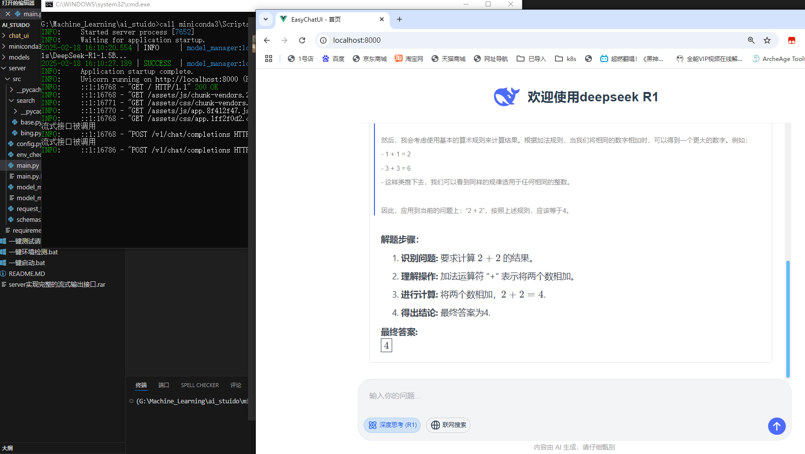
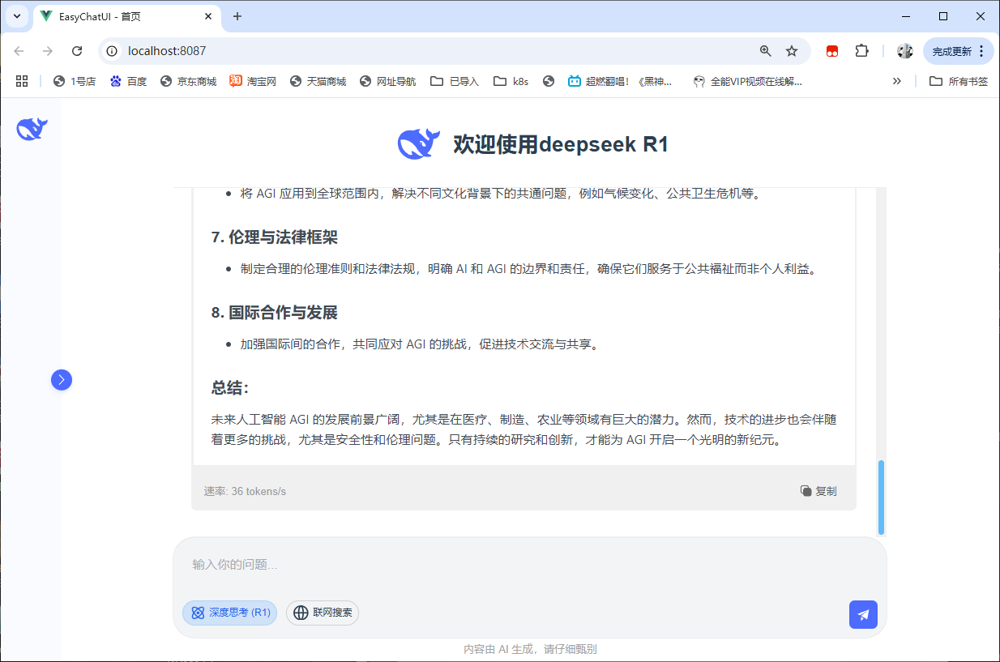
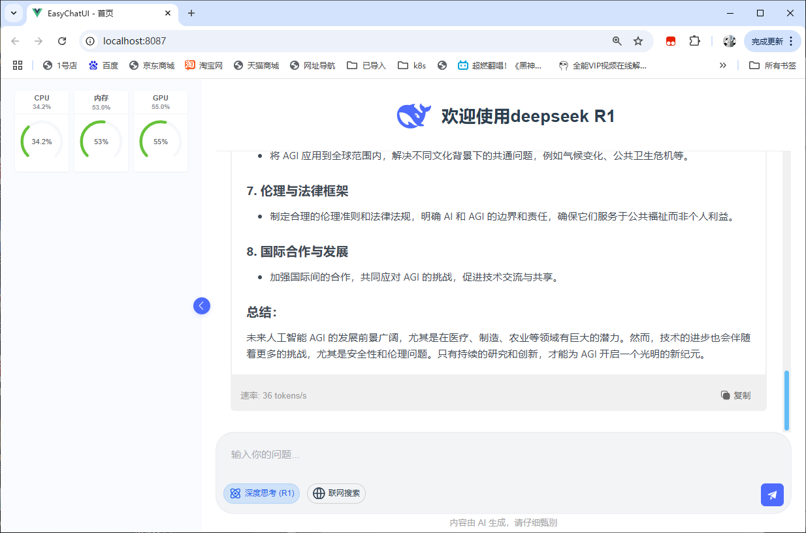

# EasyChatUI


## 项目介绍
一个基于FastAPI的轻量级本地大语言模型交互平台，支持模型热加载、流式响应和资源监控。







## 核心特性 ✨

- **即开即用** - 自动加载默认模型，快速启动服务
- **流式交互** - 支持SSE流式响应，实时生成文本
- **多模型支持** - 支持HuggingFace格式的各类LLM模型
- **资源监控** - 实时显示CPU/GPU内存使用情况
- **热加载机制** - 无需重启服务切换不同模型
- **跨平台兼容** - 支持CUDA GPU加速和CPU推理

## 快速开始 🚀

### 环境要求
- Python 3.10+
- NVIDIA显卡（推荐） + CUDA工具包
- 至少4GB显存（1.5B模型），也可以CPU运行

## 安装依赖
```
pip install -r server/requirements.txt
```
## 安装支持cuda12.1
```
pip install torch torchvision torchaudio --index-url https://download.pytorch.org/whl/cu121
```

## 项目目录

```
项目根目录/
├─ server/
│   ├─ src/
│   │   ├─ main.py           # 主入口
│   │   ├─ model_manager.py  # 模型管理模块
│   │   ├─ schemas.py        # Pydantic模型定义
│   │   ├── search
│   │   │   ├── base.py      # 抽象基类
│   │   │   ├── bing.py      # Bing实现
│   │   │   └── baidu.py     # Baidu实现（示例）
│   │   └── config.py        # 配置管理
│   └─ requirements.txt      # 依赖文件
├─ chat_ui/                  # 前端项目
├─ miniconda3/               # 环境依赖
└─ models/
    └─ your_model/           # 你的模型文件
        ├─ config.json
        ├─ model.safetensors
        └─ tokenizer.json
```

## 准备模型文件
```
mkdir -p models/your_model
# 将HuggingFace格式模型文件放入该目录
```
## 启动运行
直接运行目录中的`一键启动.bat`

注意不要忘记运行编译ui项目生成dist静态目录，也就是项目访问目录
```
npm run build
```
或者运行项目
```
npm run serve
```

### 访问界面
浏览器打开 http://localhost:8000

### 测试API状态接口：
```
curl http://localhost:8000/api/status
# 应返回：
# {"model_loaded":true,"current_model":"DeepSeek-R1-1","device":"cuda"}
```

### 测试加载模型（相对项目根目录的路径）
```
curl -X POST http://localhost:8000/api/load_model -H "Content-Type: application/json" -d "{\"model_path\": \"models/DeepSeek-R1-1.5B\"}"
```

### 测试发送问答请求

```
# 流式测试
curl -X POST "http://localhost:8000/v1/chat/completions" -H "Content-Type: application/json" -d "{\"messages\": [{\"role\": \"user\", \"content\": \"你好，请写一首关于秋天的诗\"}],\"stream\":true}" --no-buffer -v


# 非流式测试
curl -X POST "http://localhost:8000/v1/chat/completions" -H "Content-Type: application/json" -d "{\"messages\": [{\"role\": \"user\", \"content\": \"你好\"}]}"
```

### 测试系统资源占用状态
```
curl http://localhost:8000/api/system_info
# 应返回：
# {"cpu_usage":"0.0%","memory_used":"7.66 GB","memory_total":"15.90 GB","gpu_memory_used":"3.33 GB","gpu_memory_total":"6.00 GB"}
```

## 项目贡献
1. e4glet

## 项目地址
https://gitee.com/e4glet/easy-chat-ui

## 一键端完整包「EasyChatUI_Deepseek_R1_made_by_e4glet_v1.3.1.rar」
点击链接即可下载。
链接：https://pan.quark.cn/s/b8ce68d1cbaf